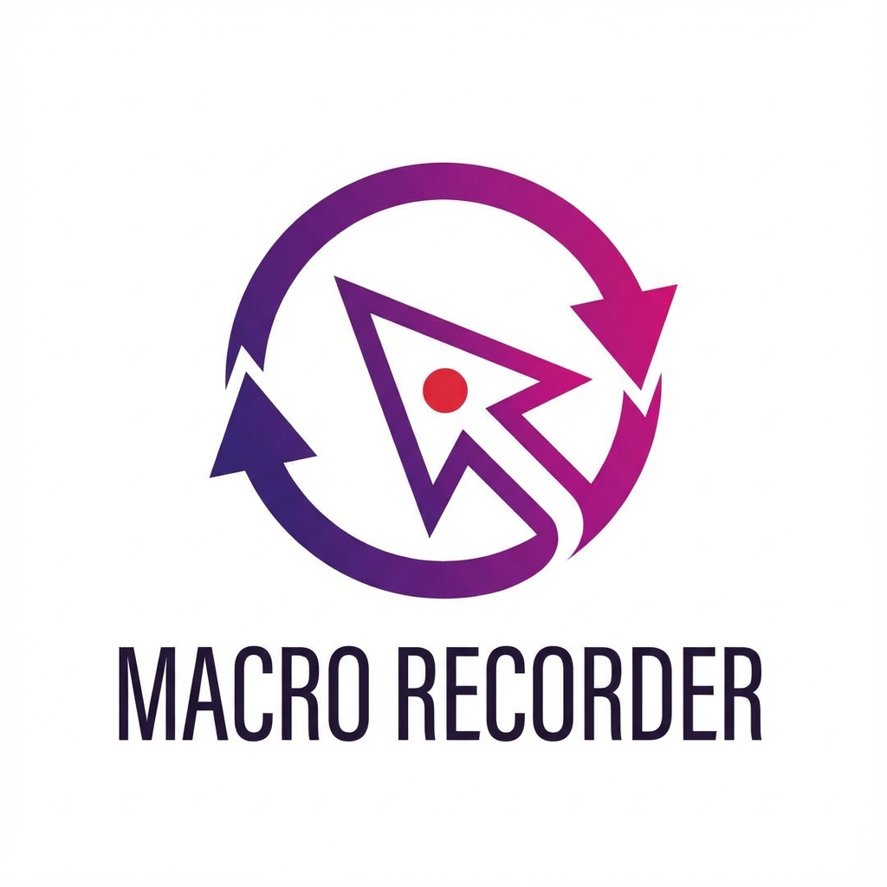

<div align="center">
  <a href="https://github.com/filippofinke/macro-recorder">
    
  </a>
  <h3 align="center">Macro Recorder</h3>
</div>

> Record and playback mouse macros with a lightweight Python CLI tool.

This project captures mouse events (movements, clicks, scrolls) and allows you to replay them at configurable speeds with pause/resume functionality. Built with [pynput](https://github.com/moses-palmer/pynput) for input capture and [rich](https://github.com/Textualize/rich) for a beautiful terminal UI.

## Features

- Real-time recording of mouse movements, clicks, and scrolls
- Playback with adjustable speed multiplier
- Infinite or fixed repeat count
- Pause/resume during recording and playback
- Live status display with event counters
- JSON-based recording format for easy inspection

## Installation

**System-wide (recommended)**

```bash
pipx install git+https://github.com/filippofinke/macro-recorder.git
```

Or with uv:

```bash
uv tool install git+https://github.com/filippofinke/macro-recorder.git
```

**From source**

```bash
git clone https://github.com/filippofinke/macro-recorder.git
cd macro-recorder
uv sync  # or: pip install -e .
```

> **Note:** macOS requires accessibility permissions for input capture.

## Quick Start

**Record a macro**

```bash
macro-recorder record my-macro
```

Press `Cmd+R` to stop recording.

**Play a macro**

```bash
macro-recorder play my-macro.json
```

Press `ESC` to stop playback.

## Usage

### Record

```bash
macro-recorder record <name> [-o OUTPUT_DIR] [-d DELAY]
```

| Option         | Description                     | Default           |
| -------------- | ------------------------------- | ----------------- |
| `-o, --output` | Output directory                | Current directory |
| `-d, --delay`  | Seconds before recording starts | 3                 |

### Play

```bash
macro-recorder play <file> [-s SPEED] [-r REPEAT]
```

| Option         | Description                        | Default |
| -------------- | ---------------------------------- | ------- |
| `-s, --speed`  | Playback speed multiplier          | 1.0     |
| `-r, --repeat` | Number of repeats (0 for infinite) | 1       |

### Info

```bash
macro-recorder info <file>
```

Shows recording statistics (duration, event counts).

## Keyboard Shortcuts

| Key         | Action         |
| ----------- | -------------- |
| `Cmd+R`     | Stop recording |
| `Cmd+Space` | Pause/Resume   |
| `ESC`       | Exit playback  |

## Author

**Filippo Finke**

- Website: [https://filippofinke.ch](https://filippofinke.ch)
- Twitter: [@filippofinke](https://twitter.com/filippofinke)
- GitHub: [@filippofinke](https://github.com/filippofinke)
- LinkedIn: [@filippofinke](https://linkedin.com/in/filippofinke)
